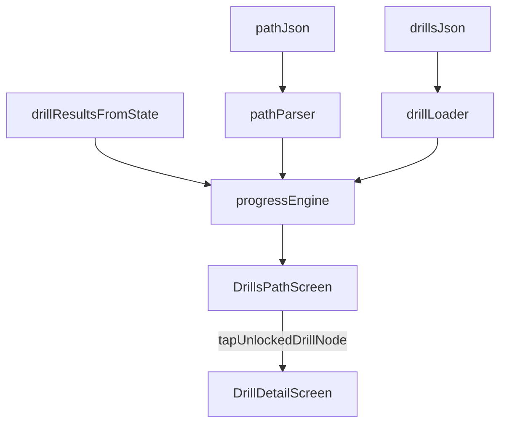

# Drill Path Mobile Rollout

## Target Outcome
Ship a new `Drill Path` screen in mobile that mirrors prototype behavior/visual hierarchy: tier chapters, path nodes with statuses, progress summaries, and animated `Continue` current node.

## Prototype Behaviors To Preserve
- Chapter-based journey (`Bronze` -> `Elite`) with chapter header, stars `earned/max`, and chapter progress bar.
- Node states: `locked`, `available`, `current`, `completed` with distinct visuals.
- Serpentine path layout (alternating horizontal offsets) plus central dotted/dashed spine.
- `current` node shows `Play + Continue` label and a pulsing ring animation.
- Drill node navigation opens drill detail when node has a drill reference and is unlocked.

## Data Model + JSON Design
- Keep drill definitions unchanged in [mobile/native_app/src/data/drills/drills.json](mobile/native_app/src/data/drills/drills.json).
- Add a separate path definition file (new): [mobile/native_app/src/data/drills/path.json](mobile/native_app/src/data/drills/path.json).
- Add path domain parser/types (new): [mobile/native_app/src/domain/drillPath.ts](mobile/native_app/src/domain/drillPath.ts).
- Add path data loader/selectors (new): [mobile/native_app/src/data/drillPath.ts](mobile/native_app/src/data/drillPath.ts).

Proposed `path.json` shape (v1, extensible):
- `version: number`
- `chapters: PathChapter[]`
- `PathChapter`
  - `id`, `tier`, `name`, `tagline`, `order`
  - `unlock`: `{ requiresChapterId?: string; minStars?: number }`
  - `nodes: PathNode[]`
- `PathNode`
  - `id`, `title`, `kind: "drill" | "boss" | "chest" | "checkpoint"`
  - `drillId?: string` (must map to drill catalog when `kind="drill"`)
  - `maxStars: 3`
  - `unlock`: `{ requiresNodeId?: string; minStars?: number }`
  - optional visual metadata: `icon?: "crosshair" | "crown" | "sparkles" | "medal"`, `offsetVariant?: 0..4`

Progress/status should be computed at runtime from persisted `drillResults` + unlock rules (not duplicated in JSON), so JSON remains authoring-focused.

## Progress Computation Strategy
- Use existing persisted results from [mobile/native_app/src/data/AppStateContext.tsx](mobile/native_app/src/data/AppStateContext.tsx).
- Derive per-node status:
  - `completed`: best stars > 0 and completion criteria met
  - `current`: first available non-completed node in progression order
  - `available`: unlocked but not current/completed
  - `locked`: unlock conditions not met
- Derive chapter stats:
  - `chapterEarnedStars`, `chapterMaxStars`, `chapterPct`
- Derive hero stats:
  - `totalStars`, `maxStars`, `currentTier` (same fallback logic as prototype)

## UI Implementation Plan
- New screen: [mobile/native_app/src/features/drills/DrillsPathScreen.tsx](mobile/native_app/src/features/drills/DrillsPathScreen.tsx)
  - Hero summary card
  - Chapter banners
  - Path spine + serpentine node rows
  - Optional “Browse full drills library” CTA to `Drills`
- New reusable components (optional split if file grows):
  - [mobile/native_app/src/features/drills/components/PathNodeCard.tsx](mobile/native_app/src/features/drills/components/PathNodeCard.tsx)
  - [mobile/native_app/src/features/drills/components/ChapterCard.tsx](mobile/native_app/src/features/drills/components/ChapterCard.tsx)
- Navigation update in [mobile/native_app/src/navigation/AppNavigator.tsx]
  - Add `DrillsPath` route.
- Entry point wiring:
  - Add a `Drill Path` CTA from drills area (likely [mobile/native_app/src/features/drills/DrillsScreen.tsx](mobile/native_app/src/features/drills/DrillsScreen.tsx) and optionally dashboard/profile menu).

## Continue Animation Parity
- Recreate prototype `pulse-ring` using RN `Animated`:
  - Looping ring with scale `1 -> ~1.35` and opacity `0.35 -> 0` every ~1.8s.
  - Render as non-interactive absolute ring behind current node (`pointerEvents="none"`).
- Keep node press feedback via scale-down on press (`active:scale-95` equivalent).

## Visual Fidelity Notes
- Use existing theme tokens from [mobile/native_app/src/core/theme/theme.ts](mobile/native_app/src/core/theme/theme.ts).
- For dashed spine on Android, prefer `react-native-svg` line with `strokeDasharray` if border-dash looks inconsistent.
- Preserve compact labels/truncation and icon badges for boss/chest nodes.

## Validation + Rollout
- Add/adjust tests for:
  - path parsing/validation
  - status derivation from `drillResults`
  - unlock rule behavior
- Manual checks:
  - zero-progress profile
  - partially completed path
  - fully completed chapter transitions
  - current node animation performance on Android
- Update changelog in [mobile/native_app/CHANGELOG.md](mobile/native_app/CHANGELOG.md).

## Data Flow

