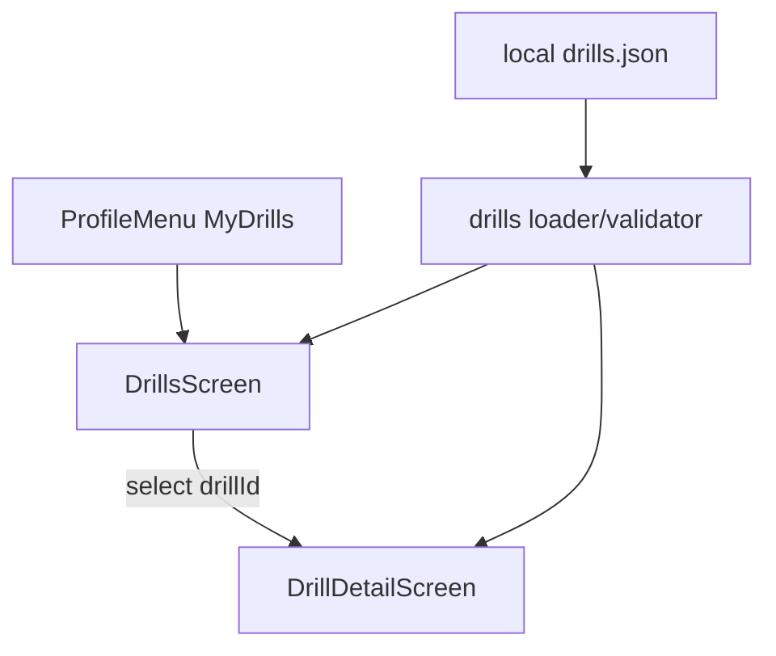

# Drill Page Implementation Plan

## Goal
Implement the prototype Drill experience in mobile with required integration, using a local JSON source and a scalable list+detail structure (starting with one dummy drill).

## Scope Confirmed
- Entry point: **only** `Profile menu -> My Drills`
- Structure: **Drill list page + drill detail page**

## Implementation Steps
- Add drill domain types + parser/mapper for JSON v1 schema from docs.
  - New files under mobile app domain/data, centered around [`c:/workspace/elite-training/mobile/native_app/src/domain/types.ts`](c:/workspace/elite-training/mobile/native_app/src/domain/types.ts) patterns.
  - Include minimal validation (cue ball existence, object balls >=1, order references existing object balls).
- Add local JSON-backed dummy drill source and loading structure.
  - Create a static JSON file (one drill) under app source/assets structure.
  - Add a repository/loader utility to parse and expose `list` + `getById` style access for future API replacement.
- Build `Drills` list screen.
  - Show drill cards with name, difficulty, category, and estimated attempt/time metadata.
  - Navigate to detail on tap with drill id.
- Build `Drill` detail/play screen matching prototype behavior.
  - Recreate key sections seen in prototype: header, difficulty/goal row, table visual, objective/focus chips, attempt controls, timer, score, result modal, restart/done flow.
  - Reuse existing visual components where possible (e.g., `PoolBall` look language) and implement lightweight table renderer for normalized coordinates.
- Wire navigation integration.
  - Register new stack screens in [`c:/workspace/elite-training/mobile/native_app/src/navigation/AppNavigator.tsx`](c:/workspace/elite-training/mobile/native_app/src/navigation/AppNavigator.tsx).
  - Update `My Drills` route in [`c:/workspace/elite-training/mobile/native_app/src/features/dashboard/ProfileMenu.tsx`](c:/workspace/elite-training/mobile/native_app/src/features/dashboard/ProfileMenu.tsx) from placeholder to real navigation.
- Keep current app logic intact.
  - No changes to precision session tracking flow unless drill detail explicitly needs “start session” handoff later.
  - Keep subscription behavior unchanged (no new gating in this pass).

## Key Files Expected
- Navigation + entry integration:
  - [`c:/workspace/elite-training/mobile/native_app/src/navigation/AppNavigator.tsx`](c:/workspace/elite-training/mobile/native_app/src/navigation/AppNavigator.tsx)
  - [`c:/workspace/elite-training/mobile/native_app/src/features/dashboard/ProfileMenu.tsx`](c:/workspace/elite-training/mobile/native_app/src/features/dashboard/ProfileMenu.tsx)
- New drill feature files:
  - `.../src/features/drills/DrillsScreen.tsx`
  - `.../src/features/drills/DrillDetailScreen.tsx`
  - `.../src/features/drills/components/PoolTable.tsx` (or equivalent)
- New drill data/domain files:
  - `.../src/domain/drills.ts` (types + validation)
  - `.../src/data/drills.ts` (loader/repository)
  - `.../src/data/drills/drills.json` (dummy source)
- Changelog:
  - [`c:/workspace/elite-training/mobile/native_app/CHANGELOG.md`](c:/workspace/elite-training/mobile/native_app/CHANGELOG.md)

## Data + Navigation Flow

## Validation Plan
- Type-check and lint touched files.
- Verify flow: Profile menu -> My Drills -> list -> detail.
- Verify dummy drill loads from JSON, attempts/timer/result modal work.
- Verify no regressions in existing session/report/dashboard/subscription flows.