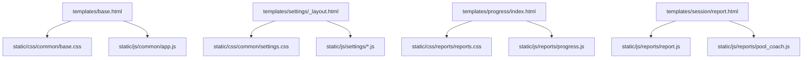

# Inline CSS/JS Segregation Plan

## Goal
Move inline styles, inline event handlers, and inline executable scripts out of templates into page/feature-based static files, while preserving current UX and logic.

## Existing Conventions To Preserve
- Keep shared styles/scripts in common buckets:
  - [`static/css/common/base.css`](static/css/common/base.css)
  - [`static/css/common/settings.css`](static/css/common/settings.css)
  - [`static/js/common/toast.js`](static/js/common/toast.js)
  - [`static/js/common/local_datetime.js`](static/js/common/local_datetime.js)
- Keep page/feature behavior in dedicated files:
  - [`static/css/dashboard/dashboard.css`](static/css/dashboard/dashboard.css)
  - [`static/css/session/session.css`](static/css/session/session.css)
  - [`static/css/reports/reports.css`](static/css/reports/reports.css)
  - [`static/js/session/live.js`](static/js/session/live.js)
  - [`static/js/reports/progress.js`](static/js/reports/progress.js)
  - [`static/js/reports/pool_coach.js`](static/js/reports/pool_coach.js)

## Refactor Mapping
- **Global shell + profile modals**
  - Source: [`templates/base.html`](templates/base.html)
  - Move modal inline styles into [`static/css/common/base.css`](static/css/common/base.css)
  - Move inline profile modal script into new [`static/js/common/app.js`](static/js/common/app.js)
  - Add deferred include in base layout and keep existing global scripts intact.

- **Dashboard page behavior/styling**
  - Source: [`templates/dashboard/index.html`](templates/dashboard/index.html)
  - Remove inline `onclick` and style attributes
  - Move page behavior into new [`static/js/dashboard/dashboard.js`](static/js/dashboard/dashboard.js)
  - Keep styling in existing [`static/css/dashboard/dashboard.css`](static/css/dashboard/dashboard.css)

- **Reports/analytics pages**
  - Sources: [`templates/progress/index.html`](templates/progress/index.html), [`templates/session/report.html`](templates/session/report.html), [`templates/partials/pool_coach_modal.html`](templates/partials/pool_coach_modal.html)
  - Consolidate inline presentation styles into [`static/css/reports/reports.css`](static/css/reports/reports.css)
  - Add report page logic (delete action, chart setup, tooltip wiring) to new [`static/js/reports/report.js`](static/js/reports/report.js)
  - Replace inline hover handlers with class-based hover states in CSS
  - Keep CDN Chart.js include where required; keep data payloads server-rendered but not executable inline JS.

- **Session live page**
  - Source: [`templates/session/live.html`](templates/session/live.html)
  - Remove inline close handlers/styles and wire events from existing [`static/js/session/live.js`](static/js/session/live.js)
  - Move remaining inline styles to [`static/css/session/session.css`](static/css/session/session.css)

- **Settings pages and partials**
  - Sources: [`templates/settings/tiers.html`](templates/settings/tiers.html), [`templates/settings/ai_mesh.html`](templates/settings/ai_mesh.html), [`templates/settings/about.html`](templates/settings/about.html), [`templates/settings/profiles.html`](templates/settings/profiles.html), [`templates/partials/tier_badge.html`](templates/partials/tier_badge.html)
  - Move inline layout/presentation styles into [`static/css/common/settings.css`](static/css/common/settings.css)
  - Create settings-specific JS modules:
    - [`static/js/settings/tiers.js`](static/js/settings/tiers.js)
    - [`static/js/settings/ai_mesh.js`](static/js/settings/ai_mesh.js)
    - [`static/js/settings/profiles.js`](static/js/settings/profiles.js)
  - Add script blocks via [`templates/settings/_layout.html`](templates/settings/_layout.html) or page `settings_scripts` blocks.

## Behavioral Safety Strategy
- Replace inline handlers (`onclick`, `oninput`, `onmouseover`, `onmouseout`, `onsubmit`) with `addEventListener` and delegated listeners.
- Preserve all IDs/data-* hooks currently consumed by scripts.
- Preserve fetch endpoints and payload shapes exactly.
- Keep semantic/template-generated data in attributes or JSON script tags only when needed for data transfer.

## Sequencing
1. Global/base extraction first (used everywhere).
2. Reports pages next (largest inline density and shared modal usage).
3. Dashboard + session live cleanup.
4. Settings pages and shared partials.
5. Final pass: remove residual inline attributes and run smoke checks.

## Validation Checklist
- Navigation and modal open/close still work.
- Profile creation/switching still works.
- Progress and session report charts render identically.
- Pool coach button behavior and loading state unchanged.
- Settings forms/sliders/confirm flows still behave as before.
- Search for remaining inline constructs returns only approved non-executable data blocks.

## Dependency Flow
