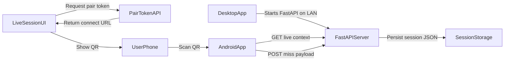

# Mobile Miss Logging via QR (V1)

## Scope Locked
- Build **Android native app** first.
- Use **QR-only discovery** in V1 (no UDP discovery/handshake yet).
- Mobile supports only miss logging controls equivalent to desktop `Log miss` dialog.

## Current System Anchor Points
- Live session page and `Log miss` dialog UI live in [`C:/workspace/elite-training/templates/session/live.html`](C:/workspace/elite-training/templates/session/live.html).
- Live session client flow is in [`C:/workspace/elite-training/static/js/session/live.js`](C:/workspace/elite-training/static/js/session/live.js), including calls to `GET /api/sessions/{id}/live` and `POST /api/sessions/{id}/racks/{rackId}/misses`.
- Miss write endpoint already exists in [`C:/workspace/elite-training/app/routers/api_sessions.py`](C:/workspace/elite-training/app/routers/api_sessions.py) (`api_add_miss`).
- Electron currently binds backend on localhost in [`C:/workspace/elite-training/electron/main.cjs`](C:/workspace/elite-training/electron/main.cjs) (`--host 127.0.0.1`), so LAN connection requires host binding changes.

## Implementation Plan

### 1) Expose Desktop Server on LAN (for mobile access)
- Update Electron backend boot args in [`C:/workspace/elite-training/electron/main.cjs`](C:/workspace/elite-training/electron/main.cjs) so server can run on `0.0.0.0` for mobile access.
- Keep Electron internal calls stable by continuing to use loopback for self-checks (`127.0.0.1`) while allowing LAN ingress.
- Add a small helper to compute the preferred local IPv4 address and server base URL shown to users.
- Add a toggle/guard env var for LAN mode (default enabled for desktop app, or explicit opt-in depending product preference).

### 2) Generate Session Connect Token + QR on Live Session Screen
- Add a top-right “Connect phone” block in [`C:/workspace/elite-training/templates/session/live.html`](C:/workspace/elite-training/templates/session/live.html) that appears during active sessions.
- Include QR payload data: `{ host, port, sessionId, shortLivedToken }` as a URL (e.g. `elite-training://connect?...` plus HTTPS/http fallback URL).
- Add backend endpoint(s) in [`C:/workspace/elite-training/app/routers/api_sessions.py`](C:/workspace/elite-training/app/routers/api_sessions.py) to mint/validate a short-lived pairing token bound to session/profile.
- Add lightweight token store/service (new service file under `app/services/`) with expiry and one-session scope.
- Render QR in web UI using a small JS QR library added via [`C:/workspace/elite-training/package.json`](C:/workspace/elite-training/package.json) and a new JS module under `static/js/session/`.

### 3) Mobile-Facing API Contract for Miss Logging
- Reuse existing endpoints where possible:
  - `GET /api/sessions/{sessionId}/live` for current rack + suggestions.
  - `POST /api/sessions/{sessionId}/racks/{rackId}/misses` for writes.
- Add token-based auth requirement for mobile calls (header `Authorization: Bearer <pair_token>` or similar) on live/miss endpoints when accessed from mobile.
- Add a narrow “mobile session info” endpoint if needed to avoid extra payload and simplify Android parsing.
- Preserve existing desktop behavior by keeping current browser session auth flow unchanged.

### 4) Android App (Miss Controls Only)
- Create Android project (Kotlin + Jetpack Compose) in a new folder (e.g. `mobile/android/`).
- Implement QR scan screen (CameraX/MLKit) to parse connect payload and store server/session/token.
- Implement session control screen that mirrors desktop miss dialog fields:
  - ball number selection
  - miss type multiselect (`position`, `alignment`, `delivery`, `speed`)
  - outcome single select (`playable`, `pot_miss`, `no_shot_position`)
- On submit:
  - fetch current live context to resolve current `rackId`
  - post miss payload to existing endpoint
  - show success/error toast and keep fast repeat-entry UX.
- Add reconnect/edit-connection flow and clear offline/error states (server unreachable, token expired, session ended).

### 5) Safety + Validation + Docs
- Add token expiry/replay protection tests in Python tests (extend `tests/` around API session routes).
- Add integration test for mobile-authenticated miss logging path.
- Add a desktop UX fallback text near QR (“open this URL on phone”) for devices without scanner support.
- Update README with Android connect flow and LAN requirements (same Wi-Fi, firewall allowance, local IP format).

## Architecture Flow

## V2 (Deferred)
- Add optional “Search for desktop apps” with UDP discovery + handshake.
- Add desktop “Connect” button that broadcasts presence and shows found-device state.
- Keep V2 isolated from V1 QR flow to avoid delaying release.