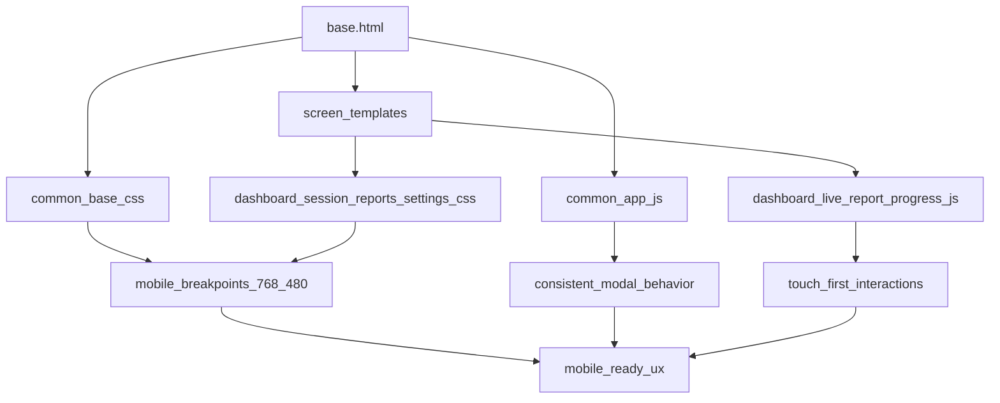

# Mobile UX Refactor Plan

## Goals
- Deliver a strong responsive web experience on iOS Safari and Android Chrome.
- Improve usability across all core screens without a full product redesign.
- Standardize mobile behavior for layout, navigation, modals, charts, and dense data views.

## Scope (Phase 1)
- Core screens: dashboard, live session, report, progress, history, settings.
- Shared shell/components: base layout, global CSS, shared JS modal/toast utilities.
- Breakpoints: `<=768px` (tablet/small landscape) and `<=480px` (phone portrait).

## Implementation Strategy

### 1) Establish mobile foundation in shared shell
- Update app shell and spacing rules in [C:/workspace/elite-training/static/css/common/base.css](C:/workspace/elite-training/static/css/common/base.css).
- Refactor global layout structure in [C:/workspace/elite-training/templates/base.html](C:/workspace/elite-training/templates/base.html) to support a compact mobile navigation pattern while preserving desktop sidebar behavior.
- Ensure viewport-safe height/scroll behavior (`100dvh` strategy, avoid locked body scroll pitfalls on mobile keyboards).

### 2) Normalize modal UX for touch devices
- Harmonize modal sizing, close affordances, and overflow behavior in:
  - [C:/workspace/elite-training/static/css/common/base.css](C:/workspace/elite-training/static/css/common/base.css)
  - [C:/workspace/elite-training/static/css/session/session.css](C:/workspace/elite-training/static/css/session/session.css)
  - [C:/workspace/elite-training/static/css/reports/reports.css](C:/workspace/elite-training/static/css/reports/reports.css)
- Adjust modal scripting behavior in:
  - [C:/workspace/elite-training/static/js/common/app.js](C:/workspace/elite-training/static/js/common/app.js)
  - [C:/workspace/elite-training/static/js/reports/pool_coach.js](C:/workspace/elite-training/static/js/reports/pool_coach.js)

### 3) Convert desktop-inline layout styles into responsive classes
- Remove/replace inline desktop layout declarations from templates and move responsive rules into CSS for maintainability:
  - [C:/workspace/elite-training/templates/dashboard/index.html](C:/workspace/elite-training/templates/dashboard/index.html)
  - [C:/workspace/elite-training/templates/session/report.html](C:/workspace/elite-training/templates/session/report.html)
  - [C:/workspace/elite-training/templates/progress/index.html](C:/workspace/elite-training/templates/progress/index.html)
  - [C:/workspace/elite-training/templates/session/live.html](C:/workspace/elite-training/templates/session/live.html)
- Implement corresponding responsive utilities in:
  - [C:/workspace/elite-training/static/css/dashboard/dashboard.css](C:/workspace/elite-training/static/css/dashboard/dashboard.css)
  - [C:/workspace/elite-training/static/css/reports/reports.css](C:/workspace/elite-training/static/css/reports/reports.css)
  - [C:/workspace/elite-training/static/css/session/session.css](C:/workspace/elite-training/static/css/session/session.css)

### 4) Optimize chart/report readability on phones
- Add mobile chart display presets (height, legend density, tick count) in:
  - [C:/workspace/elite-training/static/js/reports/progress.js](C:/workspace/elite-training/static/js/reports/progress.js)
  - [C:/workspace/elite-training/static/js/reports/report.js](C:/workspace/elite-training/static/js/reports/report.js)
- Align chart container sizing and spacing in:
  - [C:/workspace/elite-training/static/css/reports/reports.css](C:/workspace/elite-training/static/css/reports/reports.css)

### 5) Improve dense data interactions on mobile
- Introduce mobile-friendly handling for table/timeline-heavy views:
  - [C:/workspace/elite-training/templates/history/index.html](C:/workspace/elite-training/templates/history/index.html)
  - [C:/workspace/elite-training/templates/session/report.html](C:/workspace/elite-training/templates/session/report.html)
  - [C:/workspace/elite-training/static/css/common/base.css](C:/workspace/elite-training/static/css/common/base.css)
  - [C:/workspace/elite-training/static/css/reports/reports.css](C:/workspace/elite-training/static/css/reports/reports.css)
- Add touch-first tooltip/popover interaction for rack miss details in:
  - [C:/workspace/elite-training/static/js/reports/report.js](C:/workspace/elite-training/static/js/reports/report.js)

### 6) Settings pages responsive cleanup
- Improve small-screen settings navigation and form layout in:
  - [C:/workspace/elite-training/static/css/common/settings.css](C:/workspace/elite-training/static/css/common/settings.css)
  - [C:/workspace/elite-training/templates/settings/_layout.html](C:/workspace/elite-training/templates/settings/_layout.html)
  - [C:/workspace/elite-training/templates/settings/tiers.html](C:/workspace/elite-training/templates/settings/tiers.html)
  - [C:/workspace/elite-training/templates/settings/profiles.html](C:/workspace/elite-training/templates/settings/profiles.html)

## Validation Plan
- Manual responsive QA on key viewport widths: `390x844`, `430x932`, `768x1024`.
- Functional checks for all core flows:
  - Navigation
  - Live session interaction/miss logging
  - Report/progress chart readability
  - Pool coach modal open/close/submit
  - History actions and settings forms
- Regression checks on desktop layout after mobile changes.

## Execution Order
1. Shared shell + navigation + global spacing.
2. Modal normalization.
3. Screen-by-screen layout refactors (dashboard/live/report/progress/history/settings).
4. Chart/timeline/touch interaction polish.
5. Cross-device QA pass and responsive bug fixes.

## Architecture View
