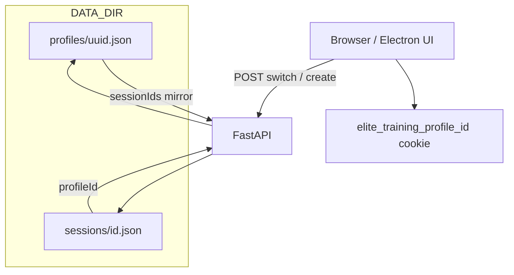

# Multi-player profiles (JSON + sidebar)

## Data model

- **New Pydantic model** `PlayerProfile` in [`app/models.py`](app/models.py): `id` (UUID string), `name` (non-empty string), `session_ids` / `sessionIds` (list of session UUID strings, order optional e.g. insertion or reverse-chronological on append).
- **New field on** [`PrecisionSession`](app/models.py): optional `profile_id` (`profileId` alias). New sessions always set it to the active profile. Old files omit it until migration.

**Storage layout** (matches “jsons with user profiles”):

- [`app/config.py`](app/config.py): `PROFILES_DIR = DATA_DIR / "profiles"`, `mkdir` alongside existing `DATA_DIR` / `SESSIONS_DIR`.
- One file per profile: `data/profiles/{profile_uuid}.json` (atomic write via existing [`app/services/atomic_json.py`](app/services/atomic_json.py)).

**Single source of truth for “who owns this session”**: keep **`profileId` on the session document** for O(1) filtering and to avoid orphan sessions if profile JSON is edited. **Also** maintain `sessionIds` on the profile JSON as requested: update both in the service layer whenever a session is created, imported, or deleted (small helper used by `start_session`, `save_session` import path, and delete).

## Services

- **New** [`app/services/profiles_repo.py`](app/services/profiles_repo.py): `list_profiles()`, `load_profile(id)`, `save_profile(profile)`, `create_profile(name) -> PlayerProfile`, `append_session(profile_id, session_id)`, `remove_session(profile_id, session_id)`, `initials(name) -> str` (e.g. two words → first letters; one word → first two letters, uppercased).
- **No silent “Default” profile in lifespan.** If `profiles/` is **empty**, the app must **not** auto-create a profile on the server alone. Instead, every HTML response includes a flag (e.g. `needs_first_profile: true`) so [`templates/base.html`](templates/base.html) shows a **blocking modal** (name required) the user must complete before using the app.
- **On first profile create** (POST from that modal, e.g. `POST /profiles/first` or reuse `POST /profiles` with guard): create `PlayerProfile`, set active-profile **cookie**, then run **`associate_all_existing_sessions(profile_id)`**: glob `SESSIONS_DIR` (or `list_sessions` without profile filter for this one-time path), for each session JSON set `profileId` to the new id if missing or still unassigned, append each session id to the new profile’s `sessionIds` (dedupe), save profile. That way **all existing sessions** belong to the first named player the user defines.
- **If profiles exist but a legacy session has no `profileId`**: when resolving the active profile, optional one-off repair: assign orphans to the **active** profile (or only when loading lists—document preference). Prefer associating orphans on next successful “switch” or a small admin repair; MVP can assign orphans to active profile on read if `sessionIds` is source of truth—simplest is backfill on first profile only and later sessions always have `profileId`.

## Active profile (server-side)

- **Cookie** e.g. `elite_training_profile_id` (httpOnly, `Path=/`, `SameSite=lax`, long max-age). Helper: `resolve_active_profile_id(request) -> str | None` returns a valid on-disk profile id **only** when profiles exist and cookie matches; returns **`None` if there are zero profiles** (UI shows modal, no cookie yet). If profiles exist but cookie missing/invalid, pick first profile lexicographically or most recently created and set cookie on next navigation (or require explicit switch—document one rule).
- **`start_session`** in [`app/services/session_service.py`](app/services/session_service.py): add `profile_id: str` argument; set on `PrecisionSession`, save session, then `profiles_repo.append_session`.
- **`sessions_repo.list_sessions`**: add optional `profile_id: str | None`. If set, filter to `session.profile_id == profile_id` (after `model_validate`). If `profile_id` is None for an old file during transition, optionally treat as belonging to default profile during migration only.
- **Delete session**: extend [`delete_session`](app/services/sessions_repo.py) or wrap in a small `sessions_service.delete_session_for_profile` that removes file **and** `profiles_repo.remove_session` for the session’s `profileId` (load session once before unlink).
- **Import** [`api_sessions.api_import_session`](app/routers/api_sessions.py): imported sessions **always** belong to the **current active profile**—set `profileId` on the validated `PrecisionSession` before `save_session`, then append the session id to that profile’s `sessionIds`. If there is no active profile (no profiles yet), return **400** with a clear message, or require the first-profile modal to have run in the UI first. For **Electron** [`electron/main.cjs`](electron/main.cjs): ensure HTTP client sends the same **Cookie** header as the browser session (or document that import is only valid when `elite_training_profile_id` is set on the loopback request).

## Authorization (light)

- Where a session is loaded for pages/APIs ([`app/routers/training.py`](app/routers/training.py), relevant API handlers): if session’s `profile_id` ≠ active profile id, return **404** (or 403) so UUIDs cannot leak across players.

## HTTP routes

- **POST** `/profiles/first` (or guarded `POST /profiles` when `list_profiles()` is empty): body `{ "name": "..." }` → create profile, set cookie, **`associate_all_existing_sessions`**, return JSON `{ ok }` or **303** to `/`. Must reject if profiles already exist (use normal add flow instead).
- **POST** `/profiles` (when profiles already exist): add another named profile, optionally switch cookie to new id or keep current—specify in implementation (typically keep current, only switch via `/profiles/active`).
- **POST** `/profiles/active` (form): `profile_id` → set cookie, **303** back.
- Optional **GET** `/api/profiles` for JSON list (id, name, initials) to feed the sidebar without embedding huge data in every page—or pass `profiles` + `active_profile` from a dependency into templates only.

## UI: sidebar + first-run ([`templates/base.html`](templates/base.html))

- **First profile (zero profiles):** a **modal** (overlay, focus trap, `aria-modal`) that cannot be dismissed without submitting a name. Submit → `POST` creates profile, sets cookie, runs **associate all existing sessions** on the server, then reload or close modal. Sidebar profile UI can be hidden or disabled until this completes.
- **Profile block** (when ≥1 profile): above or below [`sidebar__nav`](templates/base.html): current player **circle** with initials, popover listing profiles (switch = form POST `/profiles/active`), **+** opens add-profile modal (non-blocking when profiles already exist).
- Styles in [`static/css/common/base.css`](static/css/common/base.css): modal overlay, fixed-size circle, popover, focus states.

## Call-site updates (filter by active profile)

- [`app/routers/dashboard.py`](app/routers/dashboard.py): `_latest_in_progress`, session aggregates → use `list_sessions(..., profile_id=active)`.
- [`app/routers/training.py`](app/routers/training.py): history lists and any session iteration → same filter; enforce ownership on `load_session` for live/report routes.
- [`app/routers/api_sessions.py`](app/routers/api_sessions.py): `api_list_sessions` filter by active profile (read cookie in route or dependency).

## Tests

- First-profile POST associates every pre-existing session file with the new `profileId` and profile `sessionIds`.
- Import with active cookie sets `profileId` and appends to profile; import without any profile returns 4xx.
- `list_sessions` filter + ownership tests as before.

## Diagram

## Out of scope (MVP)

- Rename/delete profile, profile avatars/colors, per-profile tier settings or programs (programs remain global).
