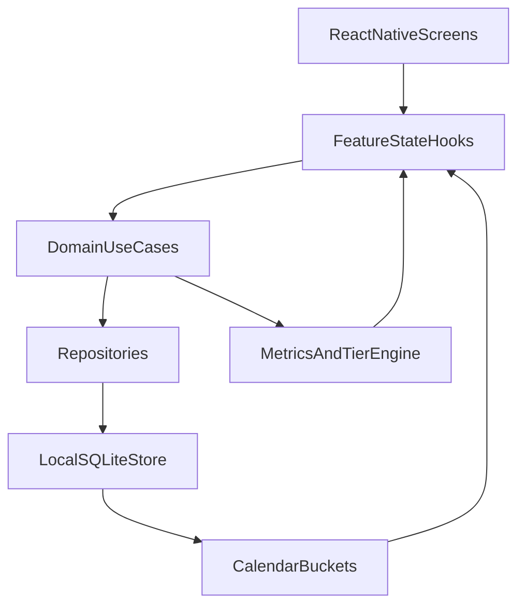

# Android-First Expo React Native Rebuild Plan

## Scope and Constraints
- Keep the current app untouched; build a separate mobile product in a new folder.
- Target Android first, but use React Native + Expo so iOS can be added with minimal architecture changes.
- Start with fresh local data (no migration from existing app).
- Ship feature parity with current core flow plus a training calendar.

## Proposed New Project Layout
- Create a new folder `mobile/native_app/` (separate from current companion app in [mobile/android](mobile/android)).
- Suggested Expo/TypeScript structure:
  - `src/core` (time, ids, constants, shared utils)
  - `src/data` (SQLite/Drizzle or SQLite wrapper models, repositories)
  - `src/domain` (session/tier/metric logic)
  - `src/features/*` (dashboard, session, report, history, calendar, profiles, settings, stats)
  - `src/ui` (theme, shared components)
  - `src/navigation` (stacks/tabs/deep links)

## Logic Reuse Map (Port from Existing App)
- Session aggregates and KPI semantics from [app/services/derived_metrics.py](app/services/derived_metrics.py).
- Rack conversion semantics from [app/services/rack_conversion_tiers.py](app/services/rack_conversion_tiers.py).
- Tier/points calculations from [app/services/training_tier.py](app/services/training_tier.py).
- Core data model semantics from [app/models.py](app/models.py).
- UX and mobile interaction ideas from [mobile/android/app/src/main/java/com/elitetraining/mobile/MainActivity.kt](mobile/android/app/src/main/java/com/elitetraining/mobile/MainActivity.kt).

## Architecture (Expo React Native, iOS-ready)

## Feature Delivery Phases

### Phase 1: App Foundation + Splash + Navigation
- Initialize Expo app with React Native + TypeScript, linting, and strict TS config.
- Add splash screen, app icon set, and theme system (light/dark-ready).
- Implement navigation shell (tabs/stacks) for Dashboard, Session, History, Calendar, Stats, Profiles, Settings.
- Seed initial local profile and sample data for first-run UX.

### Phase 2: Domain + Data Core (On-Device Logic)
- Port session/rack/miss domain model and recompute logic into TypeScript domain layer.
- Implement local persistence (Expo SQLite + repository layer; migration-safe schema).
- Implement deterministic recompute pipeline to derive:
  - pot success
  - position outcome
  - rack conversion
  - tier/points/progression
- Add parity tests against representative scenarios from existing Python logic.

### Phase 3: Core Screens (Parity)
- Dashboard: KPI cards + trend deltas + start session CTA.
- Session logging: timer, rack lifecycle, miss logging, undo.
- Session report: rack timeline, KPI breakdown, notes, tier impact.
- Session history: list, filtering, open report detail.

### Phase 4: Calendar + Progression Stats
- Calendar heatmap/list by date (trained vs not trained), count sessions/day, day drill-down.
- Stats screen for progression over time (KPI trends, tier movement, consistency metrics).
- Keep calculations fully local with snapshot + recompute strategy for correctness.

### Phase 5: Profiles + Settings + Hardening
- Profiles: create/switch/manage local players.
- Settings: tier baseline percentages, session behavior preferences, appearance.
- QA pass: offline behavior, app resume/process kill recovery, data integrity, startup performance.
- Prepare iOS enablement checklist (EAS config, app identifiers, permissions, signing path).

## Initial Milestones
- Milestone A: Expo foundation + splash + local persistence skeleton.
- Milestone B: Session logging + report fully local.
- Milestone C: Dashboard/history/calendar/stats complete.
- Milestone D: Profiles/settings polish + Android release candidate.
- Milestone E: iOS enablement pass (build/test/signing readiness).

## Visual Prototype Prompt (for design generation)
Use this prompt to generate screen prototypes aligned with the build plan:

"Design a modern cross-platform mobile app (React Native, Android-first but iOS-ready) called Elite Training, dark/light theme friendly, clean athletic UI, mobile-first, no web elements. Include these screens: (1) Splash screen with logo and subtle motion, (2) Dashboard with three KPI cards: Pot Success, Position Outcome, Rack Conversion, plus tier badge, points, and Start Session button, (3) Live Session screen with large timer, rack status, ball selector 1-9, miss-type chips (Position, Alignment, Delivery, Speed), outcome chips (Playable, Pot Miss, No Shot), primary Log Miss action, undo, start/end rack controls, (4) Session Report screen with KPI summary cards, rack-by-rack timeline, miss markers, and tier impact, (5) Session History list with date, duration, KPIs, tap for report, (6) Calendar screen with training heatmap dots/squares showing trained vs non-trained days and count per day, (7) Profiles management screen for multiple players, (8) Settings screen for tier baseline percentages and app preferences, (9) Stats screen with progression charts over weeks/months for the three KPIs and tier points. Style: premium but minimal, rounded cards, clear hierarchy, bold key numbers, high readability, touch-friendly controls, consistent iconography, compact yet breathable spacing."
