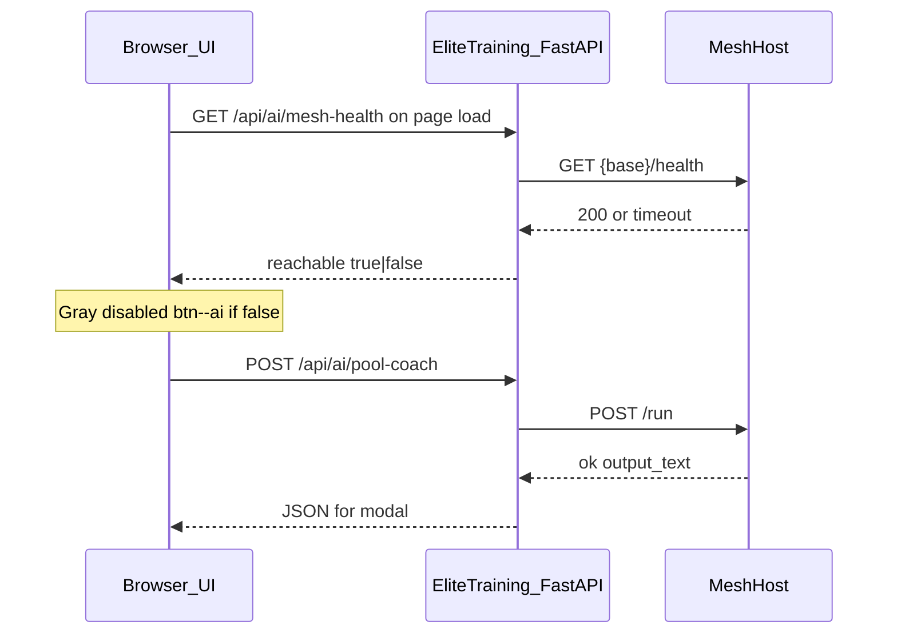

# Pool billiards coach (mesh) integration

## Contract (from handbook + your requirements)

- Mesh HTTP API: synchronous **`POST {base}/run`** with body shaped like **`RunPayload`**: required fields **`runtime_name`**, **`agent_name`**, **`user_id`**, **`message`** (string). Per [agentic-mesh-external-integration-handbook.md](C:\workspace\skeletons\agentic-mesh-external-integration-handbook.md), put structured stats in **`message`** via **`JSON.stringify(...)`** (or server-side `json.dumps`).
- Target: **`runtime_name` = `pool_billiards_coach_runtime`**, **`agent_name` = `pool_billiards_coach`**, base URL **configurable per deployment and per user** (see Settings below). Default when unset: **`http://127.0.0.1:8090`**.
- **Browser CORS**: the stock mesh host does not ship CORS for browser-direct calls (handbook **A7**). **Do not call the mesh origin from the browser**; add a **FastAPI BFF** for `/run` and for **`GET /health`** (ping).

## Architecture

## Mesh base URL resolution

1. **Primary (user-facing)**: Persist **`baseUrl`** in **`data/mesh_settings.json`** (or similar) via a small store mirroring [app/services/tier_settings_store.py](c:\workspace\elite-training\app\services/tier_settings_store.py) — load/save, atomic write, sane default when missing.
2. **Optional override**: Environment variable (e.g. `ELITE_MESH_BASE_URL`) for containers/CI; **document precedence** in code comments: env wins if set, else file, else default `http://127.0.0.1:8090`.
3. **Normalization**: Strip trailing slashes on save; validate scheme `http`/`https` and that parsing succeeds (reject junk).

## Settings UI

- New routes under [app/routers/settings.py](c:\workspace\elite-training\app/routers/settings.py): **`GET /settings/ai-mesh`** (form with current URL, short help text pointing to handbook `/health` + `/run`), **`POST /settings/ai-mesh`** (save URL, redirect back with `?saved=1` or validation error query).
- Template e.g. [templates/settings/ai_mesh.html](c:\workspace\elite-training/templates/settings/ai_mesh.html) extending [templates/settings/_layout.html](c:\workspace\elite-training/templates/settings/_layout.html), `settings_nav_active` = new key (e.g. `ai_mesh`).
- Add nav link in [templates/settings/_nav.html](c:\workspace\elite-training/templates/settings/_nav.html) (label e.g. **AI coach / mesh**).
- Optional **“Test connection”** on that page: `GET /api/ai/mesh-health` (same as reports) so users verify without leaving Settings.

## Backend (coach + health)

1. **Runtime/agent**: Still configurable via env defaults if desired: `ELITE_POOL_COACH_RUNTIME`, `ELITE_POOL_COACH_AGENT` in [app/config.py](c:\workspace\elite-training/app/config.py); URL comes from resolved mesh settings above.
2. **Payload builder** — [app/services/pool_coach_payload.py](c:\workspace\elite-training/app/services/pool_coach_payload.py) (unchanged intent from prior plan):
   - Session and progress shapes (`pot`, `position`, `conversion`, `failure` 0–1, `consistency`, `recovery`, rich `context`).
3. **HTTP client** — **`httpx`** in [pyproject.toml](c:\workspace\elite-training/pyproject.toml).
4. **`GET /api/ai/mesh-health`** (new router or same [app/routers/api_ai_coach.py](c:\workspace\elite-training/app/routers/api_ai_coach.py)):
   - Resolve base URL from store/env.
   - **`GET {base}/health`** with a **short timeout** (e.g. 2–3s); treat **2xx** as reachable.
   - Return JSON e.g. `{ "reachable": true }` or `{ "reachable": false, "detail": "…" }` (no stack traces to client). **Does not require an active player profile** so Settings “Test connection” works before profile selection; coach **POST** remains profile-gated.
5. **`POST /api/ai/pool-coach`** — Same as before: build payload, `POST {base}/run`, longer timeout for LLM; use resolved base URL. If base URL invalid or health would fail, return **502** with a clear message.

## Frontend (modal + gray button)

1. **Page load ping**: On [templates/session/report.html](c:\workspace\elite-training/templates/session/report.html) and [templates/progress/index.html](c:\workspace\elite-training/templates/progress/index.html) (or shared **`pool_coach.js`**): after DOM ready, **`fetch("/api/ai/mesh-health")`**.
   - If **`reachable === false`**: set **`btn--ai`** to **`disabled`**, **`aria-disabled="true"`**, gray styling (remove or override gradient; use muted background + `cursor: not-allowed`), **`title`** / tooltip: e.g. “AI coach unavailable (mesh not reachable). Check Settings → AI coach / mesh.”
   - If reachable: keep current purple styling; click opens modal and runs coach POST as planned.
2. **Modal** — Unchanged: dialog + coach response body; if user somehow clicks while disabled, no-op.

## Testing (lightweight)

- Payload builder tests (unchanged).
- **`mesh_settings`** load/save roundtrip (monkeypatch `DATA_DIR`).
- **`/api/ai/mesh-health`**: mock httpx — success vs timeout vs non-2xx.
- Coach POST with mocked mesh still optional.

## Notes

- Handbook lists **`GET /health`** as liveness; use that for the initial ping (not `/run`).
- Gray state reflects **reachability at load time** only; if the mesh comes up later, user refreshes the page or revisits Settings to test again (acceptable v1; optional future polling not in scope unless you add it later).
