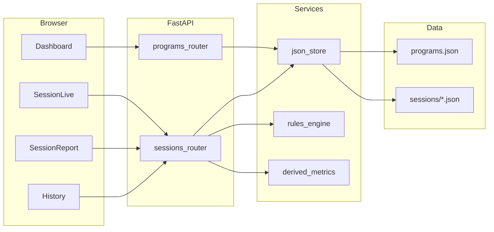

# Pool precision progression — v1.0 app redesign

## North star

Follow [docs/pool_precision_progression_notes.md](c:\workspace\elite-training\docs\pool_precision_progression_notes.md): **miss-only input**, multi-program, configurable plans/rules, modes, derived metrics, session report, history. **No backward compatibility** with alpha; old domain and `sessions/*.json` can be dropped once v1 paths work.

## What to retire vs reuse

- **Retire (replace, do not migrate):** [app/models.py](c:\workspace\elite-training\app\models.py) (`TrainingBlock`, PR/FR/CPR), [app/routers/api_session.py](c:\workspace\elite-training\app\routers\api_session.py), [app/routers/session_live.py](c:\workspace\elite-training\app\routers\session_live.py), [app/services/session_store.py](c:\workspace\elite-training\app\services\session_store.py), [app/services/time_util.py](c:\workspace\elite-training\app\services\time_util.py), [app/timer_state.py](c:\workspace\elite-training\app\timer_state.py), [app/block_presets.py](c:\workspace\elite-training\app\block_presets.py), [static/js/session/timer.js](c:\workspace\elite-training\static\js\session\timer.js), dashboard/reports JS tied to old sessions, [templates/session/live.html](c:\workspace\elite-training\templates\session\live.html) and related partials.
- **Reuse as shell:** [main.py](c:\workspace\elite-training\main.py), [app/factory.py](c:\workspace\elite-training\app\factory.py) (app wiring, static mounts), [app/config.py](c:\workspace\elite-training\app\config.py) (extend with `DATA_DIR` for v1 JSON), [templates/base.html](c:\workspace\elite-training\templates\base.html) + Metronic/light CSS if you still want that visual baseline, [static/js/common/toast.js](c:\workspace\elite-training\static\js\common\toast.js) for confirmations/errors.

## Target domain model (aligned with doc §15)

Implement as Pydantic models + explicit JSON schema version field (e.g. `schemaVersion: 1` on each file) for future evolution.

| Entity | Purpose |
|--------|--------|
| **Program** | `id`, `name`, `durationDays`, `active` (only one active at a time; enforce in service layer) |
| **Plan** | `id`, `programId`, `name`, `focusType`, `targetDiameter`, `rules` (flags + numeric thresholds from §11) |
| **Session** | `id`, `planId`, `startedAt`/`endedAt`, `tableType`, `mode`, aggregates (`totalRacks`, `totalMisses`, plus cached derived fields for report speed) |
| **Rack** | `id`, `sessionId`, `rackNumber`, `ballsCleared`, `endedAt` optional, ordered **MissEvent** list |
| **MissEvent** | `id`, `ballNumber`, `types[]` (multi-select §6), `outcome` (pot miss / no shot / both), `confidence` optional, timestamps |

**Enums** (single source of truth in Python + mirrored in frontend constants): miss types, outcomes, confidence, table type, session mode (§10), plan `focusType`.

## Persistence layout (JSON, signal over volume)

Under a single data root (e.g. `data/` or configurable via [app/config.py](c:\workspace\elite-training\app/config.py)):

- `programs.json` — list of programs + embedded plans **or** split `programs/{programId}.json` if you prefer smaller writes; MVP can be one file + atomic rewrite (simple lock or “write temp + rename” on Windows).
- `sessions/{sessionId}.json` — full session document: metadata + `racks[]` each with `misses[]` (normalized nesting is easier for reports than separate rack files).

**Derived fields:** compute on write (after each miss / rack end / session end) in a small **domain service** so the UI and reports stay dumb: per-rack `ballsCleared` from miss ball numbers + rack rules; session-level aggregates from doc §8–§9.

## Rules engine (MVP from §11)

- Store per-plan defaults; allow **session-level overrides** when starting a session (checkboxes / numbers).
- Implement in pure Python: consecutive-miss counter per rack (or per session—**decide explicitly**: doc says “reset after 3 consecutive misses”; default **per rack** is simplest and matches “rack” mental model). Surface **UI state**: “warning” at 2 misses, optional “rack reset” or “session reset” at 3—product copy should match the chosen behavior.
- “Free ball correction” stays **out of persistence** (note-only or skip) per doc.

## API surface (FastAPI)

New router package e.g. `app/routers/v1/` or flat `programs.py`, `sessions.py`:

- **Programs:** `GET/POST /api/programs`, `PATCH /api/programs/{id}` (set active, rename), `POST /api/programs/{id}/plans` (nested create).
- **Session lifecycle:** `POST /api/sessions` (body: `planId`, `tableType`, `mode`, optional rule overrides) → creates `IN_PROGRESS` session; `POST /api/sessions/{id}/end`.
- **Racks:** `POST /api/sessions/{id}/racks` (start rack N+1); `POST /api/sessions/{id}/racks/{rackId}/end` (finalize balls cleared if not already).
- **Misses:** `POST /api/sessions/{id}/racks/{rackId}/misses` (MissEvent payload); optionally `PATCH` for edit-within-session.
- **Read:** `GET /api/sessions/{id}` (full doc for live + report), `GET /api/sessions` (history list with pagination/sort by date).

HTML routes (Jinja): `/` dashboard (programs + active + “Continue session” if in progress), `/session/{id}` live, `/session/{id}/report` post-end, `/history` list.

## UX flows (minimal UI §14)

1. **Dashboard:** list programs; create/edit program + plans (forms for §4 fields); set active program; button **Start session** (picker: plan, mode, table).
2. **Live session:** large **Log Miss**; show current rack number, suggested next ball (auto-increment, editable in modal); optional compact strip for consecutive-miss warning.
3. **Miss modal:** required ball #; multi-select types; outcome; optional confidence; confirm → POST miss → refresh aggregates client-side or re-fetch session fragment (HTMX optional later; MVP can be `fetch` + small DOM updates).
4. **End rack / new rack** explicit control (secondary) so `ballsCleared` and streak logic stay well-defined when user clears table without a miss.
5. **Session report** (§12): server-rendered from same `GET` model as client; charts for trends can wait—tables + key numbers first.
6. **History** (§13): table of sessions with link to report; later add simple sparkline or reuse a minimal chart lib if [static/js/reports/charts.js](c:\workspace\elite-training\static\js/reports/charts.js) is replaced.

## Architecture sketch

## Implementation phases (match doc §16 MVP)

1. **Scaffold v1 domain + storage** — new models file(s), JSON read/write with atomic save, delete old routers/services from alpha and trim [app/factory.py](c:\workspace\elite-training\app/factory.py) includes.
2. **Programs + plans CRUD** — API + simple Jinja forms; enforce one `active` program.
3. **Session lifecycle + racks** — create session, start/end rack, persist nested JSON.
4. **Miss logging** — modal + POST; validate enums; multi-select types; support “no shot due to position” outcome.
5. **Derived metrics + rules** — service functions + unit tests (balls cleared, first miss ball, session totals, miss-type %, consecutive miss warning/reset).
6. **Session report + history** — report page from stored aggregates; history list with filters (by program/plan later).
7. **Polish** — empty states, delete session, validation messages, optional seed data for dev.

## Testing

- **Unit tests** for `derived_metrics` and `rules_engine` (table-driven: ball sequence → expected `ballsCleared`, streak flags).
- **API tests** with `TestClient` for happy paths: create program → plan → session → rack → miss → end → report fields populated.

## Explicit exclusions (doc §17)

No AI coaching, no auto table vision, no social—keep routes and models free of placeholders for those to avoid scope creep.
