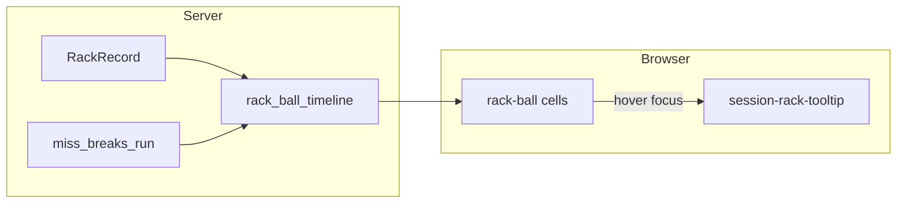

# Session report: rack ball timeline + custom tooltips

## Context

- The Racks table today is plain markup in [`templates/session/report.html`](templates/session/report.html) (`#`, Balls cleared, Misses count, Ended).
- Per-ball data already exists on [`MissEvent`](app/models.py): `ball_number` (1–9), `types` (`MissType` list), `outcome` (`MissOutcome`).
- **Hard vs soft** is already defined as run-breaking vs training in [`miss_breaks_run`](app/services/derived_metrics.py) (`POT_MISS` / `BOTH` = hard; `PLAYABLE` / `NO_SHOT_POSITION` = soft). This is the right source of truth for “outcome only after hard stop” in tooltips.

## Ball cell logic (1–9)

For each ball index `i`:

1. **Miss present** (`any m.ball_number == i`): render a **miss** cell. If any such `m` is hard (`miss_breaks_run(m)`), treat the cell as **hard miss** styling; otherwise **soft miss** styling. When multiple misses share the same ball (rare), one cell; tooltip lists each event.
2. **No miss** and `balls_cleared is not None` and `i <= balls_cleared`: **potted** (success).
3. **Otherwise**: **unplayed** (muted / grey) — balls not reached on that rack.

Call [`recompute_rack_balls_cleared`](app/services/derived_metrics.py) (or rely on existing `recompute_session_aggregates` path) so `balls_cleared` is populated for ended racks the same way aggregates already infer it, keeping the timeline consistent with the rest of the report.

**Open racks** (`ended_at` is null): use explicit `balls_cleared` when present; where it is missing, fall back to “show misses + grey for unknown tail” (documented limitation) rather than guessing clearance.

## UI / column

- Add one column (e.g. **“Run”** or **“Balls”**) containing a compact flex row of **9** small circles or rounded squares (ball index inside or below in mono).
- **Potted**: filled / brand or green token consistent with existing report accent (reuse CSS variables from [`static/css/reports/reports.css`](static/css/reports/reports.css)).
- **Miss**: icon or color cue from **primary** `MissType` when exactly one type; if multiple types, use a **split** or **stacked** micro-indicator (two half-colors or a tiny “+N” badge) so it stays readable at ~20–24px total width per ball.
- **Unplayed**: outline or faint fill, `opacity` / `var(--muted)` so it reads as “not played.”

## Tooltip (custom, modern)

- **Do not** use the native `title` tooltip.
- Add a **single** floating element (e.g. `#session-rack-tooltip`) appended once in the report template (or mounted by a small script), styled like Chart.js tooltips already on the page (dark surface, radius ~8px, shadow, `Outfit`/mono per existing report fonts).
- **Interaction**: `mouseenter` / `mousemove` / `mouseleave` and **keyboard** `focus` / `blur` on each interactive cell (`<button type="button">` for semantics); optional `Escape` to hide. Position with `getBoundingClientRect` + `position: fixed`, flip if near viewport edge; respect `prefers-reduced-motion` for fade.
- **Content**:
  - Header: `Ball N`
  - Always show **miss type labels** (humanized: Position, Alignment, Delivery, Speed) for each logged miss on that ball.
  - Show **outcome** line **only** for misses where `miss_breaks_run(m)` (e.g. “Outcome: Pot miss”) — soft misses omit outcome text (or a single line “Training log” without raw enum) so it matches your “outcome only after hard stop” requirement.

Populate tooltip text in JS from `data-*` attributes built server-side (avoids fragile HTML-in-JSON escaping), or from a compact JSON blob on the row—pick one; **data-* per cell** is usually simplest.

## Backend / template wiring

1. New small module e.g. [`app/services/rack_timeline.py`](app/services/rack_timeline.py) exporting something like `rack_ball_timeline(rack: RackRecord) -> list[dict]` with stable keys for template/JS (`ball`, `state`, `types`, `events` with `hard` flags and string keys for outcomes).
2. Register a Jinja filter in [`app/deps.py`](app/deps.py) (same pattern as `format_duration_ms`) e.g. `rack_ball_timeline`, so the template can loop `` without bloating the router.
3. Update [`templates/session/report.html`](templates/session/report.html): new `<th>`, new `<td>` with the 9 cells; include minimal markup + `data-*` / `aria-label`.
4. Add CSS under [`static/css/reports/reports.css`](static/css/reports/reports.css) for `.rack-timeline`, `.rack-ball`, modifiers `--potted`, `--miss-soft`, `--miss-hard`, `--idle`, and `.rack-tooltip` (+ visible state). Bump the existing `?v=` query on the report’s stylesheet link if you change CSS.
5. Add a short IIFE or external script include at the bottom of `report.html` (next to existing Chart script) to wire tooltip behavior—keep scope limited to `.rack-timeline` so other pages are unaffected.

## Tests

- New [`tests/test_rack_timeline.py`](tests/test_rack_timeline.py): table-driven cases mirroring existing rack fixtures in [`tests/test_derived_metrics.py`](tests/test_derived_metrics.py) (pot miss at ball 5 → balls 1–4 potted, 5 hard miss, 6–9 unplayed; soft-only on ball 4 with `balls_cleared=9` → 4 soft miss, rest potted; clean rack → nine potted).

## Optional polish (if time)

- Legend row under the table explaining green / amber (soft) / red (hard) / grey.
- `aria-describedby` pointing to a visually hidden description for screen readers when tooltip is open.

