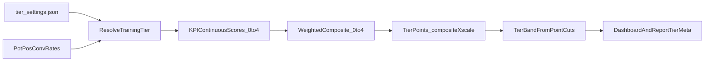

# Smooth Tier Scoring Plan

## Goal
Replace hard step scoring (`0..4` per KPI) with interpolated scoring inside each configured band so tier points move continuously toward promotions/demotions instead of jumping by large chunks.

## Current Behavior to Preserve
- Threshold configuration remains in [data/tier_settings.json](data/tier_settings.json): `pot_pct_lower_bounds`, `pos_pct_lower_bounds`, `conv_pct_lower_bounds`.
- KPI weights and points scaling remain in [data/tier_settings.json](data/tier_settings.json): `weight_*`, `composite_points_scale`.
- Tier labels and point-band mapping remain in [app/models.py](app/models.py) and [app/services/training_tier.py](app/services/training_tier.py).
- Existing dashboard/session/report consumers still receive `tier_points`, `progress_pct`, `points_to_next`, `tier_index` from [app/services/training_tier.py](app/services/training_tier.py).

## Implementation Changes

### 1) Add continuous KPI scoring helper
- File: [app/services/training_tier.py](app/services/training_tier.py)
- Add a new helper such as `kpi_score_from_pct_continuous(...)`:
  - Below first bound: interpolate from `0.0` up to `<1.0` (with a configurable floor behavior).
  - Between bounds: linearly interpolate inside each interval (`1.0..2.0`, `2.0..3.0`, `3.0..4.0`).
  - At/above top bound: clamp to `4.0`.
- Ensure score stays in `[0.0, 4.0]` and handles degenerate bound edge cases safely (even though validation already enforces ascending bounds).

### 2) Switch tier resolution to continuous scores
- File: [app/services/training_tier.py](app/services/training_tier.py)
- In `_resolve_training_tier(...)`, compute KPI scores with continuous helper instead of integer helper before `composite_score(...)`.
- Keep `composite_score(...)` unchanged (already supports floats).
- Keep `tier_points_from_composite(...)`, `tier_index_from_tier_points(...)`, and `training_tier_dashboard_meta(...)` unchanged so all downstream routes/templates continue working.

### 3) Remove step-scoring path and migrate to one scoring model
- Files:
  - [app/services/training_tier.py](app/services/training_tier.py)
- Remove branching/fallback logic tied to step scoring for tier computation paths.
- Keep threshold, weight, and points-cut settings unchanged; only scoring from KPI % to KPI score becomes continuous.
- Keep settings UI focused on one model (no scoring-mode toggle).

### 4) Update functional docs and scoring explanation
- Files:
  - [docs/matrix-calculation-of-tier.md](docs/matrix-calculation-of-tier.md)
  - [docs/player-guide-functional.md](docs/player-guide-functional.md)
- Document interpolation math with examples around threshold boundaries.
- Clarify that points can now move smoothly each session even if KPI remains in same broad band.

### 5) Regression and behavior tests
- File: [tests/test_training_tier.py](tests/test_training_tier.py)
- Add tests to assert:
  - Continuous score monotonicity within each interval.
  - No jumps at small % changes inside a band.
  - Correct clamping at low/high extremes.
  - Dashboard meta (`points_to_next`, `progress_pct`) remains valid and stable.
  - Tier index transitions still align with configured `composite_points_upper_bounds`.

## Data/Flow Overview

## Rollout Strategy
- Implement helper + tests first.
- Validate current user data by spot-checking known sessions and dashboard meta before/after.
- Ship continuous scoring as the only scoring behavior in this 0.2.x phase.

## Acceptance Criteria
- Small KPI improvements produce small tier-point changes (no forced 200/300/500 jumps).
- Tier labels and thresholds still follow configured point cuts.
- Dashboard and session report continue to render valid tier meta without template changes.
- Existing tests pass plus new scoring tests.