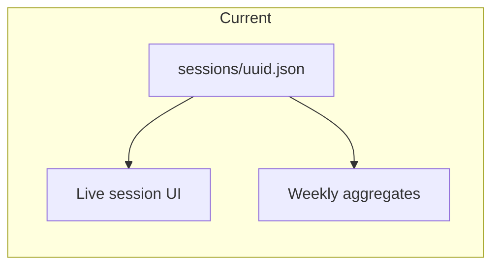

# Continue improving Elite Training

## Where you are today

The MVP already matches the core loop from the spec: UUID sessions as [sessions/*.json](c:\workspace\elite-training\app\services\session_store.py), blocks with PR/FR/CPR, active vs paused time ([app/services/time_util.py](c:\workspace\elite-training\app\services\time_util.py)), dashboard + modal + [reports with weekly charts](c:\workspace\elite-training\app\services\aggregates.py). Gaps vs [docs/training-platform-description.md](c:\workspace\elite-training\docs\training-platform-description.md) are mostly **insight depth** (§11.3–11.4), **session/block lifecycle** (§7–8, §13.5–13.6), and **UX friction** (§14).

## Phase A — Make every session easier and more honest (highest ROI)

Focus: **low friction**, **strict logging**, **clear end state**—aligned with §9–10 and §14.

1. **Keyboard-first logging on the live session**
  Map keys (e.g. `P` / `F`, `Space` pause) in [static/js/session/timer.js](c:\workspace\elite-training\static\js\session\timer.js); show a tiny on-screen legend. Reduces attention shift between table and screen.
2. **Dedicated session summary after “End session”**
  Today completion reloads the same [templates/session/live.html](c:\workspace\elite-training\templates\session\live.html). Add a read-only **summary route** (e.g. `GET /session/{id}/summary`) rendering totals, per-block table, best CPR, duration, notes—matches §10.8 / §12.5. Redirect there after `complete` (and link from dashboard/modal).
3. **Surface metadata the model already has**
  [TrainingSession](c:\workspace\elite-training\app\models.py) includes `venue_notes`; add optional fields on dashboard “start” or session header so logs stay honest about conditions (spec §7.2).
4. **Block targets and “complete block”**
  Treat `target` as structured where useful (e.g. “N perfect in a row” is future; MVP can stay text but add **manual “Complete block”** + persist `completed` and optional **target-reached** later). Wire API + UI to match §8.2 and §13.6.
5. **Optional FR categories (lightweight)**
  Spec §15.1: on FR, optional 1-click tag (miss, positional, speed, mental, …) stored as a **count map** or **append-only event** on the block (see Phase B). Start with counts only to avoid UI overload.

## Phase B — Event history so analytics can answer breakdown questions

Today you only store **aggregates** (total PR/FR per block). The spec’s breakdown questions (§11.3) need **ordered events** or derived metrics.

1. **Append-only `events` array on the session (or per block)**
  Each entry: `t`, `type` (`pr`|`fr`|`pause`|`resume`|`block_start`, …), optional `category` for FR, `block_id`. Keep JSON files human-readable; cap or archive old sessions if size grows.
2. **Derive metrics in [app/services/aggregates.py](c:\workspace\elite-training\app\services\aggregates.py) (or new `analytics.py`)**
  Examples: FR before first PR in a session; PR rate in first vs last 15 minutes of active time; failures after streak ≥ N. Expose on reports or a “Breakdown” subsection.
3. **Block detail / timeline view**
  Matches §12.4: one block’s event list + notes + stats (read-only page or expandable panel on live session).

## Phase C — Reporting and “consistency” narrative

1. **Time range and grain**
  Extend weekly API to **month** toggles and optional date filters; add **average CPR per week** (spec §11.2) alongside existing series.
2. **Consistency / volatility (§11.4)**
  Simple, honest heuristics: rolling CV or streak of “good sessions” (e.g. PR rate above your median). Avoid overclaiming “science”—label as descriptive.
3. **Personal bests completion (§11.5)**
  Add missing bests: **best block completion rate**, **consecutive sessions with ≥1 PR** (needs session list + rules for what counts as a “training day”).
4. **Dedicated `/bests` or reports anchor**
  You already show bests on dashboard/reports; a single scrollable “trophy” section keeps §12.7 without new navigation sprawl.

## Phase D — Programs, drills, goals (motivation + structure)

From spec §15.3–15.4:

1. **Drill library** — JSON or small DB table of block templates (name, purpose, default target); “Add from template” on live session.
2. **Goal programs** — e.g. target weekly hours or CPR by block type; show progress on dashboard (read-only v1).

## Phase E — Optional later

- **Match-day mode** (§15.2), **coach review** (§15.5), **compare two sessions** (§15.6).  
- **Backup / export**: zip `sessions/` or single JSON export for peace of mind.  
- **Tests**: pytest for `session_store`, timer flush logic, and aggregate math once events exist.

## Suggested order of execution

| Order | Work                                 | Why                            |
| ----- | ------------------------------------ | ------------------------------ |
| 1     | Keyboard shortcuts + on-screen hints | Immediate daily use            |
| 2     | Post-session summary page + redirect | Closure and review (§10.8)     |
| 3     | Complete block + venue/focus polish  | Model already partly there     |
| 4     | Event log + 2–3 breakdown metrics    | Unlocks spec §11.3             |
| 5     | FR categories (if still lightweight) | Honest failure taxonomy        |
| 6     | Reporting grain + consistency copy   | Deeper trends without new data |
| 7     | Drill library + goals                | Structure for recurring plans  |

This sequence keeps files on disk as the source of truth, avoids a premature database migration, and front-loads changes that make **today’s** training sessions smoother and easier to review honestly.