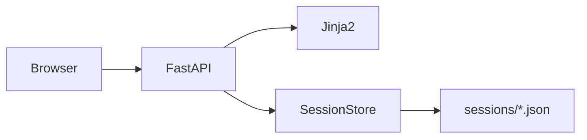

# Training platform implementation plan

## Context

[docs/training-platform-description.md](c:\workspace\elite-training\docs\training-platform-description.md) defines a **No Error pool training** tracker: sessions contain **blocks**; each log tracks **PR** (perfect racks), **FR** (failed racks), **CPR** (consecutive perfect streaks), **time** (session/block, active vs paused), and metadata. The repo today is **documentation-only**; everything below is net-new.

## Stack and entrypoint

- **Runtime**: Python 3.11+ with `uvicorn` serving a **FastAPI** app (natural pairing: Jinja2 templates, JSON APIs, static files, one process).
- **[main.py](c:\workspace\elite-training\main.py)** (repo root or `app/main.py`—pick one and keep imports consistent):
  - Use `argparse` for `--port` (default e.g. `8000`) and optionally `--host`.
  - Build the FastAPI app via a factory (e.g. `create_app()`) and call `uvicorn.run("main:app", host=..., port=..., reload=False)` **or** `uvicorn.run(app, ...)` so a single file is the entry point as requested.
- **Dependencies** (e.g. `pyproject.toml` or `requirements.txt`): `fastapi`, `uvicorn[standard]`, `jinja2`, `python-multipart` (if forms), `pydantic` v2 (via FastAPI).

## Data model and persistence

- **Storage**: directory `sessions/` at project root (add to `.gitignore`). One file per session: `sessions/{uuid}.json`.
- **Session document** (align with doc §7–8, §13): at minimum:
  - `id` (UUID string), `status` (`created` | `active` | `paused` | `completed` | `abandoned`)
  - Metadata: `started_at`, `ended_at`, optional `notes`, `focus`, optional venue/equipment
  - **Time**: `active_duration_ms` (or derive from events); optional explicit pause intervals for “active only” (doc §10.2, §13.5)
  - `blocks[]`: each with `id`, `name`, `purpose`, optional `target`, timers (`block_active_ms` or event-based), `pr`, `fr`, `cpr_current`, `cpr_best`, `attempts`, optional `notes`, `completed`
- **Service layer**: a small module (e.g. `app/services/session_store.py`) with `create_session()`, `get_session()`, `list_sessions()`, `save_session()`, atomic writes (write temp + rename) to avoid corrupt JSON on crash.

## Folder layout (functional segregation)

Mirror the doc’s screens (§12) in paths so JS/CSS/templates stay scoped:

| Area          | Templates                                    | CSS                     | JS                     |
| ------------- | -------------------------------------------- | ----------------------- | ---------------------- |
| Shared chrome | `templates/base.html`, `templates/partials/` | `static/css/common/`    | `static/js/common/`    |
| Dashboard     | `templates/dashboard/`                       | `static/css/dashboard/` | `static/js/dashboard/` |
| Live session  | `templates/session/`                         | `static/css/session/`   | `static/js/session/`   |
| Reports       | `templates/reports/`                         | `static/css/reports/`   | `static/js/reports/`   |

Mount static at `/static` and configure `Jinja2Templates(directory="templates")` with a base template that loads scoped CSS/JS per page via blocks (`` / ``).

## Routes (first vertical slice → full loop)

1. **GET /** — Dashboard: list recent sessions (from `list_sessions()` sorted by `started_at`), totals snapshot (aggregate in Python from all JSON files), **“Start session”** → creates UUID + JSON + redirect to active session.
2. **GET /session/{uuid}** — Active session page: session timer + current block UI, fast **PR** / **FR** actions (POST or `fetch` JSON to small API routes), streak display (doc §9.3).
3. **POST /api/session/{uuid}/...** — Mutations: start/pause/resume/end, log PR/FR, add block, update notes—each reloads or returns updated JSON for the client timer/state to stay in sync.
4. **GET /session/{uuid}/summary** (or modal partial) — Read-only detail for completed sessions.

## Session and block timers

- **Server authority**: persist timestamps and/or accumulated active ms on each action and on pause/resume/end so reloads and reports stay correct.
- **Client display**: `static/js/session/timer.js` uses `requestAnimationFrame` or `setInterval` for a visible **session elapsed** and **block elapsed**, seeded from server on load and adjusted after each API response (avoids drift-only client clocks).
- **Pause**: when status is `paused`, client shows frozen time; server does not add to active duration until resume (doc §10.2).

## Modal: open sessions from dashboard

- Dashboard rows include **“View”** (or click row) opening a **modal** (markup in `templates/dashboard/` + minimal `static/js/dashboard/session_modal.js`).
- **Pattern**: `GET /partials/session/{uuid}` returns an HTML fragment (Jinja partial, no full layout) inserted into the modal; alternatively return JSON and render client-side—**HTML partial is simpler** and matches Jinja-first approach.
- Content: session metadata, block list, PR/FR/CPR totals, duration, notes—enough for review without navigating away.

## Reports over time (MVP)

- **GET /reports** — Page under `templates/reports/`.
- **Backend**: `app/services/aggregates.py` scans `sessions/*.json`, filters `completed` (and optionally `abandoned` with a toggle), buckets by **week** (doc §11.2): total PR, FR, training hours, best CPR, optional breakdown by block name.
- **Frontend**: `static/js/reports/charts.js` + **Chart.js** (vendor copy under `static/js/vendor/` or CDN with SRI—your choice) for 2–4 charts (e.g. PR per week, FR per week, hours per week). Keep v1 read-only; no heavy stats engine.

## Personal bests and “where this goes”

- After aggregates exist, surface **personal bests** (doc §11.5) on the dashboard or a small `/reports#bests` section: max CPR, max PR in one session, longest session duration—computed from the same scan.

## Order of implementation (recommended)

1. Project skeleton: dependencies, `.gitignore`, `sessions/`, `create_app`, static/template mounts, `--port`.
2. JSON schema + `SessionStore` + Pydantic models for validation on read/write.
3. Dashboard + create session + list.
4. Active session page + API for PR/FR + pause/resume/end + persistence.
5. Block CRUD minimal (add block, select “current” block for logging).
6. Modal partial for session detail from dashboard.
7. Reports page + aggregates + charts + personal bests.

## Out of scope for this first pass (per doc §15 or depth)

- Error categories on FR, drill library, coach mode, full “breakdown analysis” UI—defer until core loop and reports feel solid.

## Files to add (illustrative)

- `main.py`, `pyproject.toml` or `requirements.txt`, `.gitignore`
- `app/__init__.py`, `app/factory.py` or inline app in `main.py`
- `app/services/session_store.py`, `app/services/aggregates.py`
- `app/routers/` split by area (dashboard, session, api, reports, partials) **or** a single `routes.py` if you prefer fewer files initially
- Under `templates/` and `static/` as in the table above

This sequence follows the functional plan in the doc while delivering your explicit requirements: **UUID-scoped JSON files**, **Uvicorn + Jinja**, **scoped assets**, `**--port`**, **timed sessions**, **session modals**, and **reports over time**.